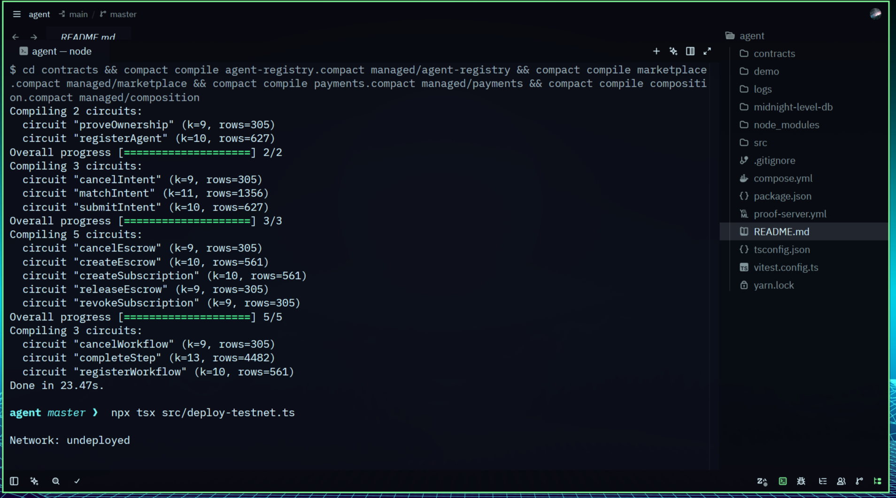
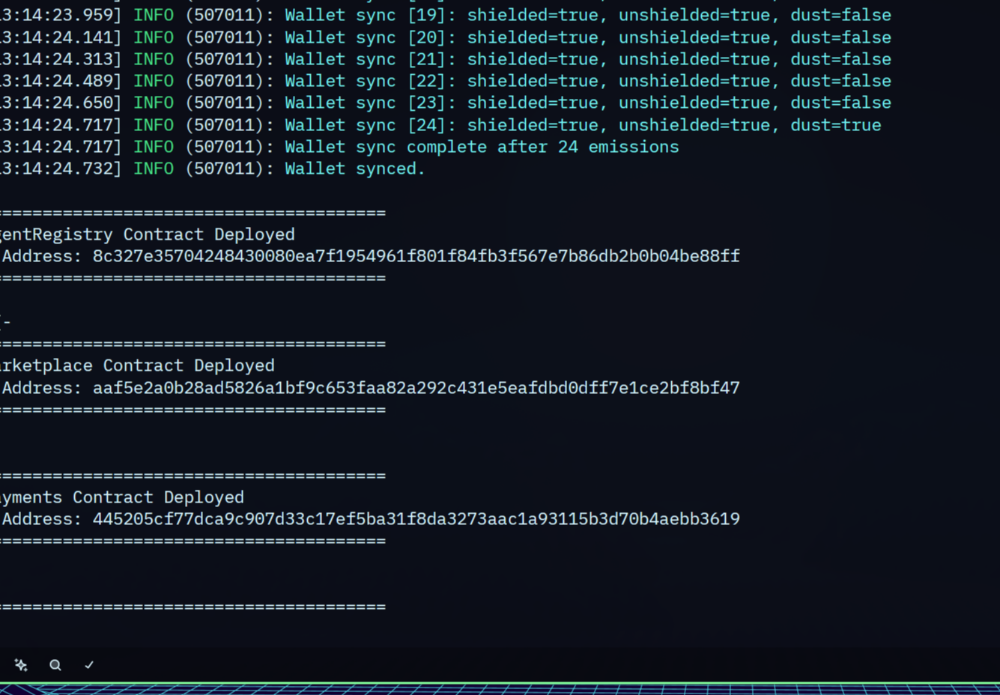

# Midnight AI Agent Marketplace

A privacy-focused platform for buying, selling, and composing AI agents on Midnight Network. Agents register with hidden capabilities via ZK commitments, buyers submit shielded intents, and payments flow through hybrid escrow — all without revealing sensitive data on-chain.

## Product Idea

Midnight Agent Marketplace enables privacy-preserving AI agent discovery and execution. Agent providers register their models on-chain with capability commitments (hiding model details, pricing, and performance metrics), while buyers submit encrypted intent queries that match against providers using ZK proofs — ensuring neither party reveals their full requirements or offerings until both agree to a transaction. The platform supports per-call micropayments, subscription access, and outcome-based pricing through shielded escrow, and chains multiple agents via DAG workflows for complex multi-step AI pipelines.

## Smart Contracts

| Contract | Circuits | Purpose |
|----------|----------|---------|
| `agent-registry.compact` | `registerAgent`, `proveOwnership` | Register agents with commitment-based ownership |
| `marketplace.compact` | `submitIntent`, `matchIntent`, `cancelIntent` | Shielded intent matching with ZK proofs |
| `payments.compact` | `createEscrow`, `releaseEscrow`, `cancelEscrow`, `createSubscription`, `revokeSubscription` | Hybrid escrow and subscription payments |
| `composition.compact` | `registerWorkflow`, `completeStep`, `cancelWorkflow` | DAG workflow execution with step tracking |

## Public State vs Private Witness

In Midnight's Compact language, contract state is split into **public** and **private**:

- **Public state** (ledger variables declared with `ledger`): Visible to all network participants. Used for counts, commitments, hashes, and other non-sensitive data that must be verified on-chain. For example, `agentCount` in the agent registry is public — everyone can see how many agents are registered, but not who they are or what they do.

- **Private witness** (declared with `witness`): Data provided off-chain by the contract executor, never stored on-chain. Witnesses are inputs to circuits that prove computation was done correctly without revealing the data. For example, `agentCapabilities` is a witness — the agent provider supplies their capability hash, the circuit proves it matches a registered commitment, but the actual capabilities string is never published.

This separation is what makes Midnight's privacy model powerful: public state ensures verifiability and consensus, while private witnesses keep sensitive business logic (pricing, model details, user preferences) shielded from observers.

## Setup Instructions

### Prerequisites

- Node.js 22+
- Docker (for local devnet)
- Compact compiler (`compact` CLI)
- Midnight wallet extension (1AM or Lace) for frontend

### Install

```bash
# Clone the repo
git clone git@github.com:mwihoti/midagent.git
cd midagent

# Install dependencies
yarn install
```

### Compile Contracts

```bash
yarn compile
```

Output:
```
Compiling 2 circuits:        # agent-registry
Compiling 3 circuits:        # marketplace
Compiling 5 circuits:        # payments
Compiling 3 circuits:        # composition
```

Generated `contracts/managed/` directory contains:
- `contract/index.js` — TypeScript contract class with circuit wrappers
- `keys/` — Proving and verification keys for each circuit
- `zkir/` — ZK intermediate representations

### Run Tests (Local Devnet)

```bash
# Start local devnet (Docker)
yarn env:up

# Run all tests
yarn test:local

# Run a specific test
MIDNIGHT_NETWORK=local NODE_OPTIONS='--experimental-vm-modules' \
  npx vitest run src/test/agent-registry.test.ts

# Tear down devnet
yarn env:down
```

### Frontend (Lace Wallet)

```bash
cd demo
npm install

# Sync ZK assets to public/
npm run sync:zk

# Start dev server
npm run dev
```

Open `http://localhost:5173`. Connect your Lace wallet to deploy contracts and call circuits on preprod.

## Project Structure

```
agent/
├── contracts/
│   ├── agent-registry.compact      # Source contracts
│   ├── marketplace.compact
│   ├── payments.compact
│   ├── composition.compact
│   ├── agent-registry/index.ts     # Barrel files (CompiledContract)
│   ├── managed/                    # Compiler output (circuits + keys)
├── demo/                           # React frontend
│   ├── src/
│   │   ├── App.tsx                 # Main UI with wallet + contract interaction
│   │   ├── wallet.ts               # Lace wallet connect/disconnect
│   │   ├── contracts.ts            # Deploy + circuit calls via 1AM
│   │   └── compiledContract.ts     # Compiled contract wrapper
│   └── public/contract/            # ZK assets served via HTTP
├── src/
│   ├── config.ts                   # Network configuration
│   ├── wallet.ts                   # Wallet provider setup
│   ├── providers.ts                # Midnight provider bindings
│   └── test/
│       ├── agent-registry.test.ts  # 2 tests
│       ├── marketplace.test.ts     # 2 tests
│       ├── payments.test.ts        # 2 tests
│       └── composition.test.ts     # 2 tests
├── compose.yml                     # Docker devnet
└── package.json
```

## Screenshots

### Compile Output


### Contract Deployed with Address


## Privacy Patterns

1. **Commitment-Based Agent Registration**
   - Agent capabilities hidden on-chain via `persistentCommit`
   - Ownership verifiable via ZK proofs (`proveOwnership` circuit)

2. **Shielded Intent Matching**
   - Buyer requirements hidden via commitments
   - Capability proofs verify match without revealing details

3. **Hybrid Payment System**
   - Per-call micropayments via escrow
   - Subscription access passes
   - Outcome-based payments

4. **DAG Workflow Execution**
   - Workflow definitions hidden on-chain
   - Step completion tracked via commitments
   - Supports branching and conditional execution

## License

MIT
